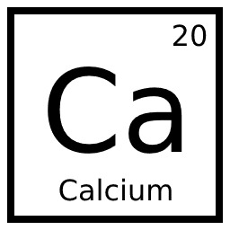

# Calcium

This is a (growing) collection of utility classes I use in my .NET projects, not intended for use by anyone but me, but anyone is welcome to use and contribute to it.

You can get the package on NuGet here: https://www.nuget.org/packages/CalciumLib/

Some of the classes in Calcium rely on Raylib-cs, which is also available on NuGet.

## Features

All methods now have XML tags for intellisense, see the code comments for method descriptions.

* **Vector2i** - Implementation of `System.Numerics.Vector2` using `int`
* **RNG** - Collection of various random chance related methods, can be instanced with a set seed
* **Direction** - Utility class containing directions represented with `Vector2i` values, as well as helper methods
* **Timer** - A general purpose timer class with the expected features, it uses Raylib to get delta time.
* **Algorithm** - Collection of some algorithms I've implemented in C#, currently only contains `GetLinePoints` and `GetCirclePoints`